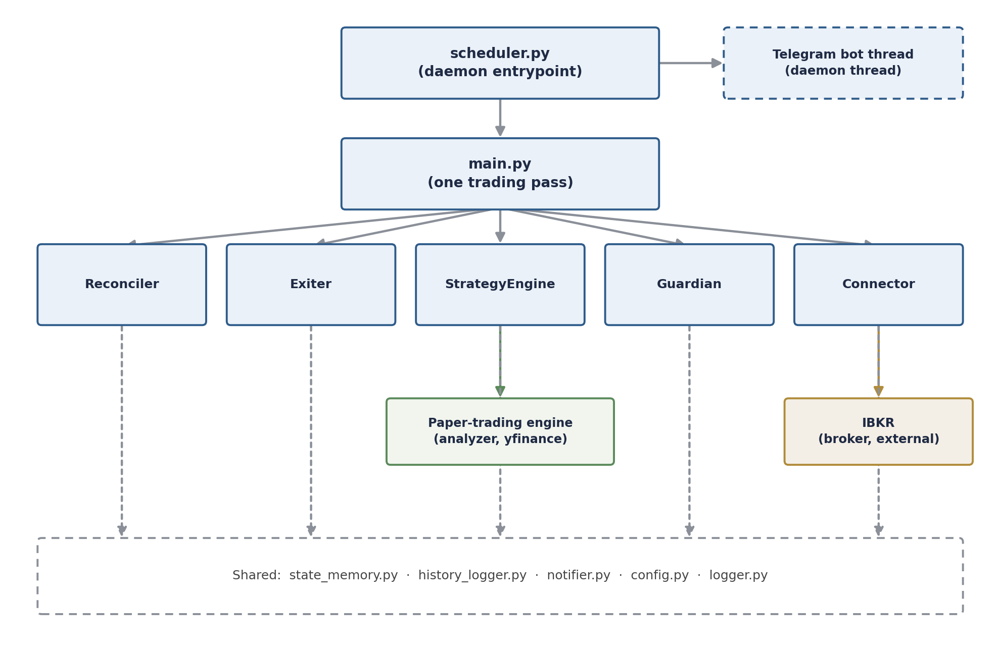
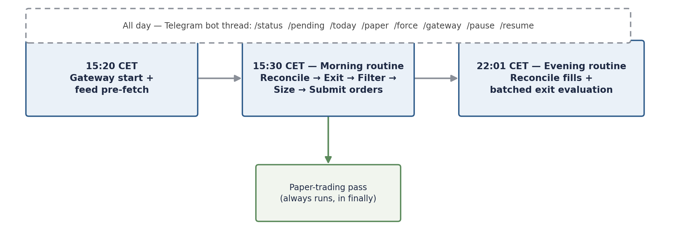

# Insider

Automated equity trading system that acts on public insider-transaction filings (SEC Form 4 / OpenInsider), executes and reconciles real orders through Interactive Brokers, and includes a parallel multi-strategy research/simulation engine.

Personal project, built and operated end-to-end by a single developer: signal ingestion, filtering and risk logic, broker integration, persistence, alerting, and deployment. Full technical write-up (architecture, testing, CI/CD): [`Insider_Documentation.pdf`](./Insider_Documentation.pdf).

> Educational / personal project. Not investment advice. See [Disclaimer](#disclaimer).

## What it does

- Scrapes a public insider-transaction feed on a schedule and pre-filters candidates (seasonality, market regime, price/volume thresholds, duplicate/held-ticker exclusion).
- Sizes approved signals against live account equity and submits bracket orders (entry + stop-loss + take-profit) to Interactive Brokers, with automatic fallback when a broker rejects a fractional-share order.
- Reconciles broker state against a local database every cycle (fills, partial fills, cancellations, equity snapshots) so the bot's view of the world never silently drifts from the broker's.
- Exposes full operational control through a Telegram bot (`/status`, `/pending`, `/force`, `/gateway`, `/pause`, `/resume`, ...) and pushes real-time alerts for disconnects, fills, and failures.
- Runs a decoupled multi-strategy simulation engine alongside the live daemon for ongoing signal-quality research, without risking live capital.

## Architecture



`scheduler.py` is the process entrypoint and composition root: it owns the job scheduler, the Telegram bot thread, and a single shared broker connection. `main.py` orchestrates one trading pass — reconcile, evaluate exits, filter new signals, size positions, submit orders — using `state_memory.py`, `history_logger.py`, `notifier.py`, `config.py`, and `logger.py` as shared infrastructure underneath.

### Daily execution cycle



## Key engineering features

- **Broker/database reconciliation** — every cycle diffs live IBKR positions and orders against local state, correctly handling full fills, partial fills, and cancellations, with rollback-on-exception around every write.
- **Fractional-share order recovery** — bracket-order submission detects the broker's specific fractional-share rejection codes and automatically resubmits at a whole-share quantity instead of failing the trade.
- **Layered price sourcing** — position sizing and the simulation engine fall back from a live broker quote to a market-data-provider historical close, so a temporary data-feed outage never blocks a pricing decision.
- **Scraper failure classification** — the signal feeder distinguishes HTTP errors, timeouts, missing page structure, and zero-rows-parsed as distinct failure modes, each raised as a specific alert (an early-warning canary for upstream layout changes).
- **Idempotent, framework-free schema migrations** — every persistence module runs `CREATE TABLE IF NOT EXISTS` plus additive `ALTER TABLE ... ADD COLUMN IF NOT EXISTS` migrations on startup, keeping deployments migration-safe without a separate migration tool.
- **Strategy-pattern simulation engine** — the research module fetches every expensive shared input once per signal and fans it out to independently pluggable, side-effect-free decision functions, so adding a new strategy variant costs one function, not a rewrite.
- **Operational alerting as a first-class channel** — nearly every module pushes structured Telegram alerts (not just log lines) for disconnects, partial fills, cancellations, and scraper breakage.

## Tech stack

| Category | Technology |
|---|---|
| Language | Python 3.11 |
| Broker integration | Interactive Brokers via `ib_insync` |
| Messaging / control | Telegram (`pyTelegramBotAPI` + REST alerts) |
| Signal source | `requests` + `BeautifulSoup` (OpenInsider) |
| Market & fundamental data | `yfinance` |
| Persistence | PostgreSQL (`psycopg2` + `SQLAlchemy`) |
| Data processing | `pandas`, `numpy` |
| Reporting | `matplotlib` (equity curve) |
| Scheduling | `schedule` |
| Configuration | `pydantic` / `pydantic-settings` |
| Error monitoring | `sentry-sdk` |
| Testing | `pytest`, `unittest.mock` |
| Containerization | Docker, Docker Compose |

## Project structure

```
Insider/
├── src/
│   ├── scheduler.py       # daemon entrypoint: job scheduling, Telegram bot thread, gateway lifecycle
│   ├── main.py             # orchestrates one trading pass
│   ├── config.py           # typed, validated settings (pydantic-settings)
│   ├── connector.py        # IBKR connection, bracket orders, resilience
│   ├── engine.py            # signal filtering pipeline
│   ├── feeder.py            # OpenInsider scraper + cache
│   ├── guardian.py          # position sizing / risk
│   ├── exiter.py             # time-based exit evaluation
│   ├── reconciler.py         # broker <-> database consistency layer
│   ├── state_memory.py       # live trading state (positions, orders, balance)
│   ├── history_logger.py     # trade ledger + equity reporting
│   ├── analyzer.py           # Piotroski F-Score fundamental analysis
│   ├── paper_logger.py       # multi-strategy simulation / research engine
│   ├── notifier.py           # Telegram alerting client
│   ├── models.py             # shared typed contracts
│   └── logger.py             # logging factory
├── tests/                    # pytest suite, mocked at the broker/DB/HTTP boundary
├── Dockerfile
├── docker-compose.yml
├── requirements.txt
└── .env.example
```

## Configuration

All settings are loaded from a single `.env` file into a typed, validated `pydantic-settings` model (`src/config.py`) — copy `.env.example` to `.env` and fill in real values. Configuration is grouped by concern: infrastructure (`DATABASE_URL`, `SENTRY_DSN`), broker connection (`IBKR_*`), strategy/filter parameters, and notification credentials (`TELEGRAM_*`). Secrets are never committed — `.env` is excluded from version control.

## Running it

```bash
cp .env.example .env      # fill in real credentials and parameters
docker compose build
docker compose up -d
```

The stack runs two containers: a PostgreSQL database and the trading daemon itself. In production this runs continuously on a self-hosted Linux (Ubuntu) server on a private network, alongside a local IB Gateway instance.

## Testing

```bash
pip install -r requirements.txt
PYTHONPATH=src pytest tests/ -v
```

The suite follows a mock-at-the-boundary approach: the broker client, database layer, HTTP calls, and market-data client are replaced with mocks so business logic — position-sizing math, exit-threshold calculations, market-regime and drawdown math, HTML-parsing, reconciliation diff/merge logic — is exercised deterministically, without a live broker, network, or database connection.

## Disclaimer

This is a personal, educational software project shared for portfolio purposes. It is not investment advice, and past or hypothetical performance is not indicative of future results. Use entirely at your own risk.
